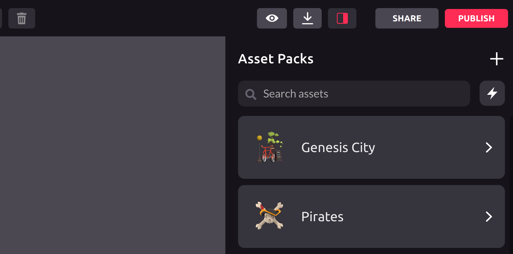
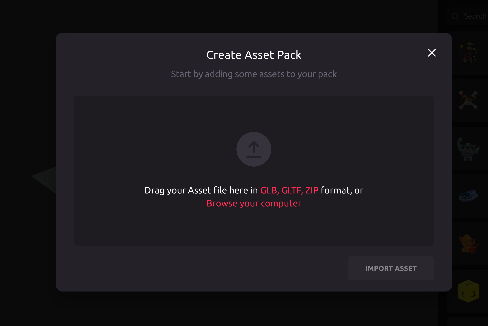
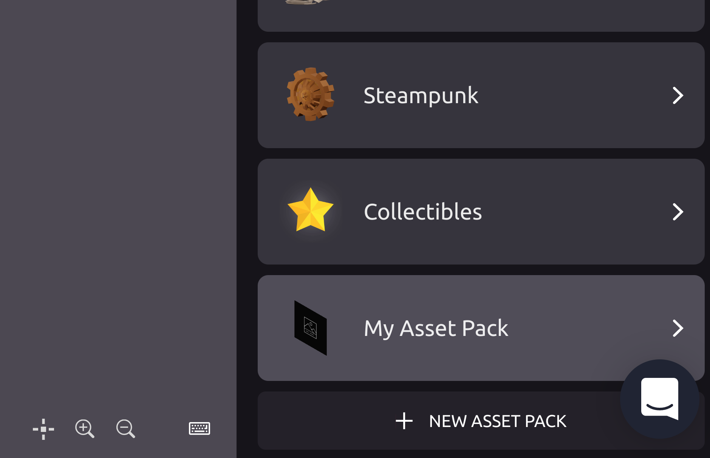
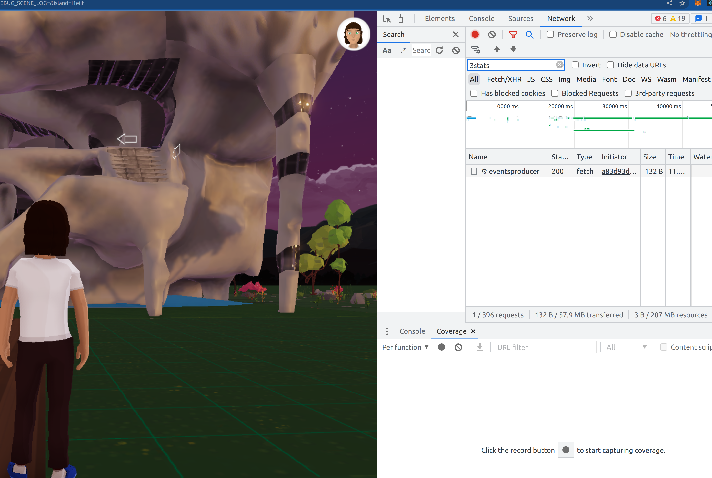

# Smart Item

## Installation

To integrate the smart item in your scene, simply download [this](https://3stats.xyz/downloads/dclSmartTracer-latest.zip)
file and import it in your builder.

### Step 1: Decentraland Builder
Go to the [builder](https://builder.decentraland.org/), open your scene and click on the `+` button,
on the right of `Asset Packs`to add a new smart item

### Step 2: import the smart item

After clicking on the `+` button, a pop up will open asking you to select a file:

Select the file you [downloaded](https://3stats.xyz/downloads/dclSmartTracer-latest.zip) and click on `Import Asset`.
Click `Continue` and then `Create Asset Pack`. After a brief load the item will be available.

### Step 3: Add the item to your scene

If you now scroll down on the list of Asset Packs you will see the smart item on the bottom:

Click on it so it will be added to your scene.

You can place the item

### Step 4: Check if it works

Publish the scene, and open a new tab and press `F12` to open your Browser console, and
then go in the `Network` tab.
Now connect to your scene and search for `3stats` in the urls:

If you can see the url, then the events are being tracked. Make sure to open the network tab
before connecting to decentraland, or the request will not appear in your logs.
